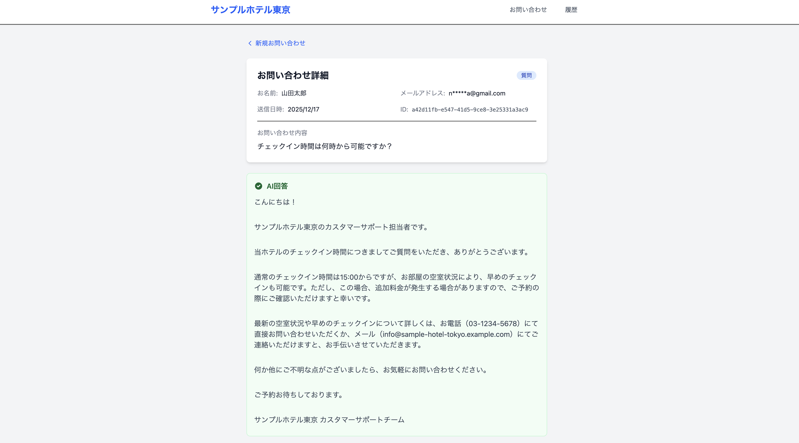
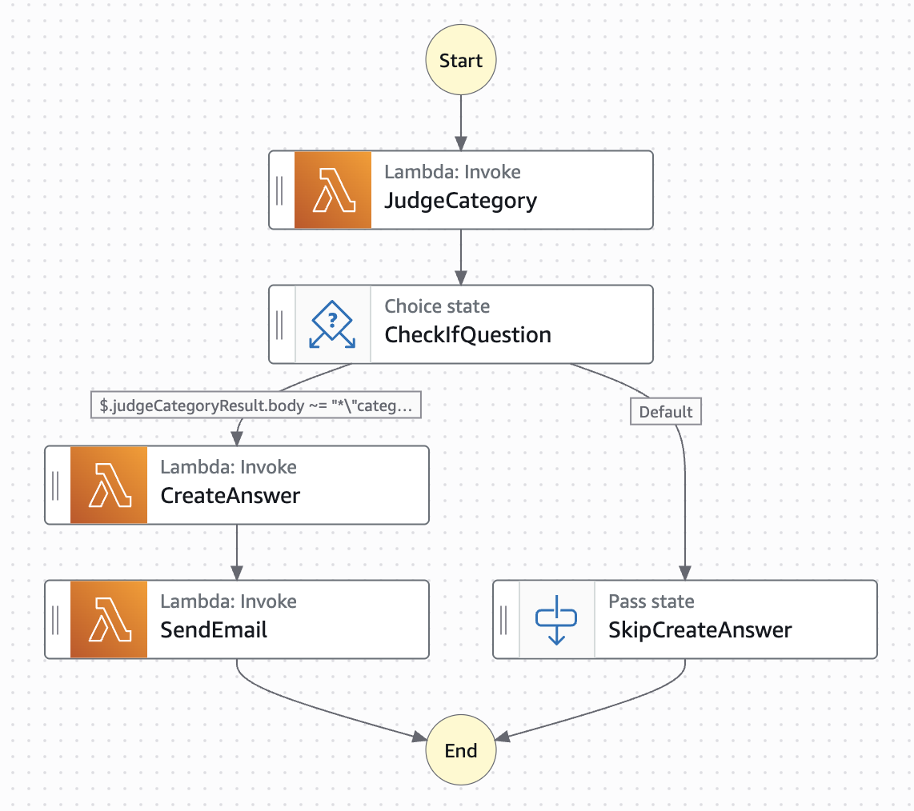

# 生成AI機能付きお問い合わせシステム

ホテル予約サイトのお問い合わせを管理するシステムです。
**Amazon Bedrock（生成AI）** を活用して、お問い合わせの自動分類と回答生成を行い、運営業務を効率化します。

## デモ

**デモサイト:** [お問い合わせフォーム](http://inquiry-frontend-dev.s3-website-ap-northeast-1.amazonaws.com)



> **注意:** デモ環境ではSESがサンドボックスモードのため、メールは送信されません。AI回答は画面上で確認できます。

---

## 主な機能

### ユーザー向け機能

| 機能 | 説明 |
|------|------|
| **お問い合わせ送信** | フォームから簡単にお問い合わせを送信できます |
| **AI回答のリアルタイム表示** | 質問への回答は、メールを待たずに画面上で確認できます |
| **自動回答メール** | 同じ回答がメールでも届きます |
| **問い合わせ履歴** | 過去の問い合わせ一覧と回答を確認できます |

### 管理者向け機能

| 機能 | 説明 |
|------|------|
| **自動分類** | AIがお問い合わせを5つのカテゴリに自動分類します |
| **日次レポート** | カテゴリ別の集計レポートが毎日自動生成されます |
| **データ分析** | 蓄積されたデータをSQLで分析できます |

### AIによる分類カテゴリ

- **質問** → AIが自動回答を生成してメール送信
- **改善要望**
- **ポジティブな感想**
- **ネガティブな感想**
- **その他**

---

## システムの特徴

### 生成AIによる自動化

- **Amazon Bedrock**（Amazon Nova Micro）を活用し、お問い合わせ内容を理解・分類
- 「質問」カテゴリには、ホテル情報を参照して自動で回答を生成
- 人手をかけずに24時間対応が可能

### 高い信頼性と拡張性

- **サーバーレスアーキテクチャ** により、アクセス増加にも自動対応
- **非同期処理** で大量のお問い合わせも安定して処理
- インフラの運用・保守コストを最小化

### データ活用基盤

- 問い合わせデータを自動集計・分析して業務改善に活用
- 本番データベースに負荷をかけない分析環境を完備
- SQLで自由にデータを分析可能

### 低コスト運用

- 使った分だけ課金されるサーバーレス構成
- 分析環境も月額約0.2ドルの低コスト設計

---

## システム構成


### 処理フロー

1. ユーザーがフォームからお問い合わせを送信
2. システムが内容をデータベースに保存
3. AIがお問い合わせ内容を分析し、カテゴリを判定
4. 「質問」の場合、ホテル情報を参照してAIが回答を生成
5. 生成した回答をユーザーにメール送信

---

## 技術スタック

### フロントエンド

| カテゴリ | 技術 |
|----------|------|
| フレームワーク | React 19 + TypeScript |
| ビルドツール | Vite |
| スタイリング | Tailwind CSS |
| 状態管理 | TanStack Query (React Query) |
| フォーム | React Hook Form + Zod |
| テスト | Vitest + Playwright |

### バックエンド（AWS サーバーレス）

| カテゴリ | 技術 |
|----------|------|
| API | Amazon API Gateway (HTTP API) |
| 処理 | AWS Lambda (Python 3.12) |
| データベース | Amazon DynamoDB |
| AI | Amazon Bedrock (Nova Micro) |
| メッセージング | Amazon SQS |
| ワークフロー | AWS Step Functions |
| メール | Amazon SES |
| スケジューリング | Amazon EventBridge |
| 分析 | AWS Glue + Amazon Athena |
| IaC | Terraform |

---

## アーキテクチャ詳細

### ワークフロー（Step Functions）



1. **JudgeCategory**: AIが問い合わせを5カテゴリに分類
2. **CheckIfQuestion**: 「質問」カテゴリかどうかを判定
3. **CreateAnswer**: 質問の場合、RAGデータを参照してAIが回答生成
4. **SendEmail**: 生成した回答をメールで送信

### 分析環境

```
DynamoDB → AWS Glue (ETL) → S3 (Parquet) → Amazon Athena
```

- 本番DBに負荷をかけずにSQLでデータ分析
- 日別・カテゴリ別の傾向分析が可能

---

## 開発者向け情報

### ディレクトリ構成

```
inquirysystem/
├── frontend/                      # React フロントエンド
│   ├── src/
│   │   ├── api/                  # API クライアント
│   │   ├── components/           # UIコンポーネント
│   │   ├── hooks/                # カスタムフック
│   │   ├── pages/                # ページコンポーネント
│   │   └── types/                # 型定義
│   └── e2e/                      # E2Eテスト (Playwright)
│
├── infrastructure/                # Terraform (IaC)
│   ├── environments/
│   │   └── dev/                  # 開発環境 (main.tf, variables.tf)
│   └── modules/
│       │
│       │  # API / Lambda
│       ├── api-gateway/          # HTTP API (POST・GET /inquiry)
│       ├── lambda/               # upload-inquiry (問い合わせ登録)
│       ├── lambda-get-inquiry/   # get-inquiry (一覧取得)
│       ├── lambda-bedrock/       # judge-category, create-answer (AI処理)
│       ├── lambda-ses/           # send-email (メール送信)
│       ├── lambda-sqs-sfn/       # execute-job (SQS→Step Functions)
│       │
│       │  # データストア
│       ├── dynamodb/             # 問い合わせテーブル + GSI
│       ├── s3-rag/               # RAGデータ (ホテル情報)
│       ├── s3-aggregation/       # 日次集計結果
│       ├── s3-analytics/         # Glue ETL出力 (Parquet)
│       ├── s3-frontend/          # フロントエンド静的ホスティング
│       │
│       │  # メッセージング / ワークフロー
│       ├── sqs/                  # 問い合わせキュー
│       ├── step-functions/       # AI処理ワークフロー
│       ├── ses/                  # メール送信設定
│       │
│       │  # スケジューリング / 分析
│       ├── eventbridge-lambda/   # 日次集計 (EventBridge + Lambda)
│       ├── glue-etl/             # DynamoDB→S3 ETL
│       └── athena/               # 分析用Workgroup
│
├── src/
│   ├── functions/                # Lambda関数ソースコード (Python)
│   ├── glue/                     # Glue ETLスクリプト
│   └── rag-data/                 # RAGデータ (JSON)
│
└── docs/                         # ドキュメント
```

### セットアップ

#### 前提条件

- Node.js 20+
- Python 3.12
- Terraform 1.6+
- AWS CLI (設定済み)

#### フロントエンド

```bash
cd frontend
npm install
npm run dev          # 開発サーバー起動
npm run test:run     # ユニットテスト
npm run test:e2e     # E2Eテスト
```

#### インフラストラクチャ

```bash
cd infrastructure/environments/dev
terraform init
terraform plan
terraform apply
```

### API仕様

#### POST /inquiry

お問い合わせを送信します。

**リクエスト:**
```json
{
  "reviewText": "お問い合わせの内容",
  "userName": "お名前",
  "mailAddress": "email@example.com"
}
```

**レスポンス:**
```json
{
  "message": "Inquiry submitted successfully",
  "id": "uuid"
}
```

| ステータス | 説明 |
|------------|------|
| 200 | 成功 |
| 400 | バリデーションエラー |
| 500 | サーバーエラー |

#### GET /inquiry

お問い合わせ一覧を取得します。

**レスポンス:**
```json
{
  "items": [
    {
      "id": "uuid",
      "reviewText": "内容",
      "userName": "名前",
      "mailAddress": "email@example.com",
      "createdDate": "2025-01-01",
      "Category": "質問",
      "answer": "AIの回答..."
    }
  ]
}
```

### Lambda関数

| 関数名 | トリガー | 役割 |
|--------|----------|------|
| upload-inquiry | API Gateway | 問い合わせ登録 |
| get-inquiry | API Gateway | 問い合わせ一覧取得 |
| execute-job | SQS | Step Functions起動 |
| judge-category | Step Functions | AI分類 |
| create-answer | Step Functions | AI回答生成 |
| send-email | Step Functions | メール送信 |
| daily-aggregation | EventBridge | 日次集計 |

### DynamoDBスキーマ

| 属性 | 型 | 説明 |
|------|-----|------|
| id | String (PK) | UUID |
| reviewText | String | 問い合わせ内容 |
| userName | String | 投稿者名 |
| mailAddress | String | メールアドレス |
| createdDate | String | 作成日 (YYYY-MM-DD) |
| Category | String | AI分類結果 |
| answer | String | AI生成回答 |

---

## ライセンス

MIT License

## 作者

naoya.iimura@gmail.com
